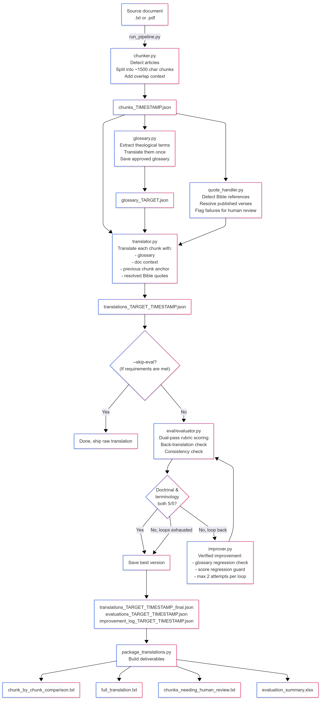
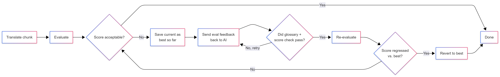

# WELS Translation Pipeline Flowchart

This is a high-level map of how a source document moves through the pipeline.
It is intended to give Alexander a one-page mental model of the system before
he starts on the front end.

## End-to-end flow

## Data each step expects (front-end design hint)

| Stage | Reads | Writes |
|-------|-------|--------|
| Chunker | source `.txt` / `.pdf` | `chunks_*.json` |
| Glossary | `chunks_*.json` | `glossary_<target>.json` |
| Quote handler | `chunks_*.json` | in-memory map; `bible_lookup_review_*.json` if any failed |
| Translator | chunks + glossary + quotes | `translations_<target>_*.json` (incremental) |
| Evaluator | source + translation + glossary | `evaluations_<target>_*.json` |
| Improver | source + translation + eval feedback | new translation text (looped) |
| Packager | all of the above | the four deliverable files |

## File-name timestamp convention

Every run uses the same `YYYYMMDD_HHMMSS` timestamp across all the files
it produces (chunks, translations, evaluations, improvement_log). This is
how the packager knows which chunks-file goes with which translations-file.
The front end can rely on this file with the same timestamp belong to
the same job.

## The "improvement loop" important to internalize

The loop has **three guards** that protect against the AI making things worse:
1. **Glossary regression**: if a fix removes an approved theological term, reject it.
2. **Score regression**: if the new version scores worse than the previous best, revert.
3. **Max-loops cap**: default 3 improvement attempts per chunk, then accept the best seen.

## Models used (from `config.py`)

- **Translator:** `claude-opus-4-6` (high-end, doctrinal accuracy is critical)
- **Evaluator:** `claude-sonnet-4-6` (faster, cheaper, runs twice per chunk)
- **Back-translator:** `claude-sonnet-4-6` (sanity check)

The API key is read from the `ANTHROPIC_API_KEY` environment variable. Nothing
is hardcoded, user will need to input their own key.